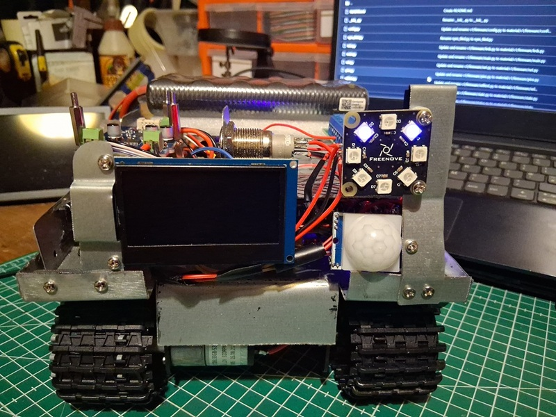

ENZO V1 FREE — CANON BASELINE

ENZO is a structured bring-up and deterministic control platform for embedded systems

Start here: docs/README_START_HERE_T1_ENZO_v1-2.md

This folder contains the V1 Free (Canon) baseline for ENZO.

What this is

Known-good hardware and firmware baseline

Trusted power architecture and pin truth

Minimal behaviour (no diagnostics UI)

Designed to be stable, repeatable, and teachable

Status

FROZEN

AUTHORITATIVE

SAFE TO RELEASE

Rules

Do not add OLED, DHT, telemetry, or diagnostics here

Changes only occur via deliberate new baseline versions

This baseline is the reference all other tiers derive from

If you want observability or diagnostics, see V1 Advanced.
