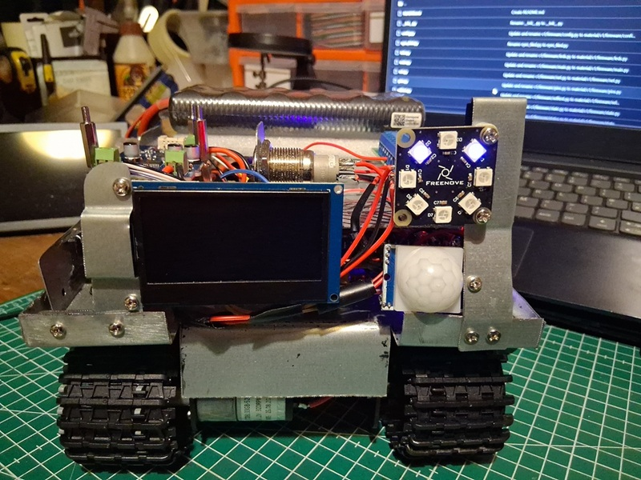

Start here: [docs/README_START_HERE_T1_ENZO_v1-2.md](docs/README_START_HERE_T1_ENZO_v1-2.md)

## Looking for the smaller ESP32 module builds?

See **ENZO-Labs** here:

[ENZO-Labs branch](https://github.com/icu6t6/DevilsLAB/tree/Enzo-Labs)

This folder contains the V1 Free (Canon) baseline for ENZO.

## What this is

Known-good hardware and firmware baseline

Trusted power architecture and pin truth

Minimal behaviour (no diagnostics UI)

Designed to be stable, repeatable, and teachable

---

Rules

Do not add OLED, DHT, telemetry, or diagnostics here

Changes only occur via deliberate new baseline versions

This baseline is the reference all other tiers derive from

If you want observability or diagnostics, see V1 Advanced.

---

## Next Step — ENZO V1 Advanced (Optional)

If you want to go beyond the baseline and actually verify your system properly:

👉 https://devilslab.gumroad.com/l/qposal

V1 Advanced is a structured diagnostics and validation layer that sits on top of a working V1 build.

It is used to:
- verify behaviour step-by-step
- expose internal system state
- validate hardware without guesswork

This is NOT required for V1.

Start with V1. Trust it. Then extend it.
