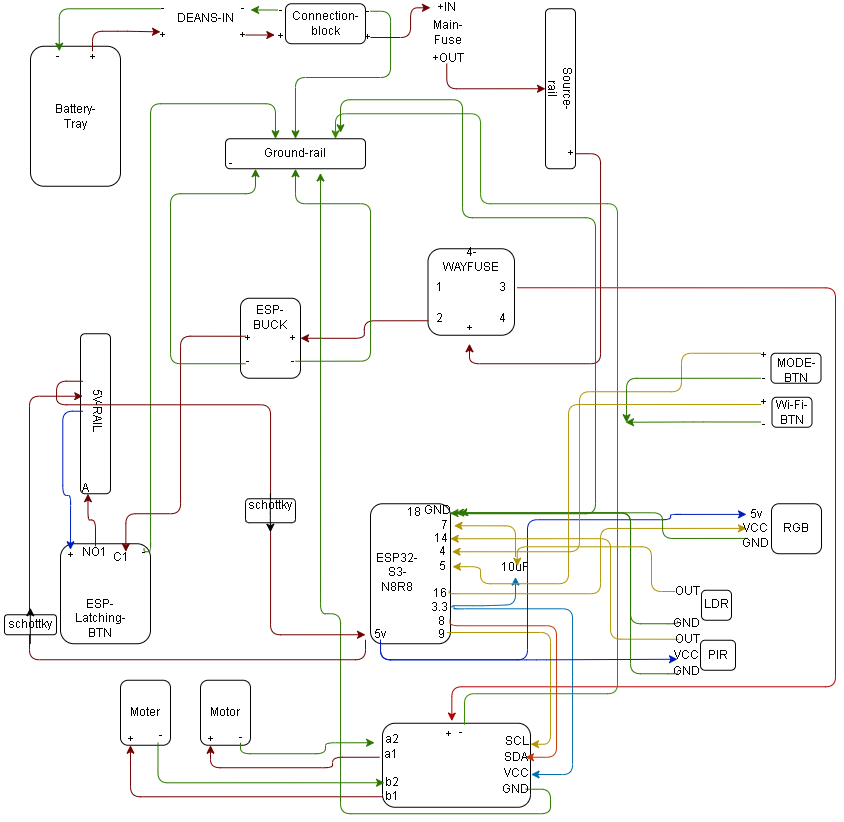

# ENZO V1 Wiring References

## Purpose
These references are split into two views because they do different jobs:

- **Power Architecture** = how ENZO is powered safely
- **Peripheral Wiring** = what connects to the ESP32-S3 and where

Both should be used together.

---

## 1. Power Architecture
Use the existing V1 power architecture reference for:
- battery path
- fuse path
- source rail
- buck / UBEC path
- ground rail strategy
- ESP power entry

This answers:

**How is ENZO powered and distributed safely?**

---

## 2. Peripheral Wiring
This companion diagram shows the pin-level wiring for the **free V1 build**.

It covers:
- ESP32-S3
- DONE / MODE / Wi-Fi buttons
- RGB
- LDR
- PIR
- motor driver connections

This answers:

**What plugs into what in V1?**

---

## Usage Rule
Do not treat these diagrams as replacements for each other.

- **Power Architecture** explains the electrical structure
- **Peripheral Wiring** explains the peripheral and pin connections

This wiring view is intended to reflect **V1 only**.

Old diagram explains it.  
New diagram builds it.
