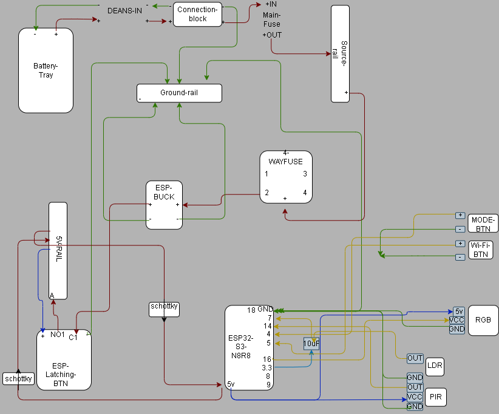

# ENZO V1 Wiring Reference

## Purpose
This page uses a single combined V1 diagram.

Both the **power architecture** and the **peripheral wiring** can be seen in this one reference image.

It is intended to give a clear V1 view of:
- how ENZO is powered and distributed safely
- what connects to the ESP32-S3 and where

---

## Combined V1 Wiring / Architecture View
This combined diagram reflects the **free V1 build**.

It includes:
- power path / architecture
- source rail / distribution view
- ESP32-S3 peripheral wiring
- DONE / MODE / Wi-Fi buttons
- RGB
- LDR
- PIR

This answers:

**How is ENZO wired, and how is V1 powered?**

---

## Usage Rule
This image is intended to function as a single combined V1 reference.

It should be read as:
- **power architecture**
- **peripheral wiring**

in one diagram.
