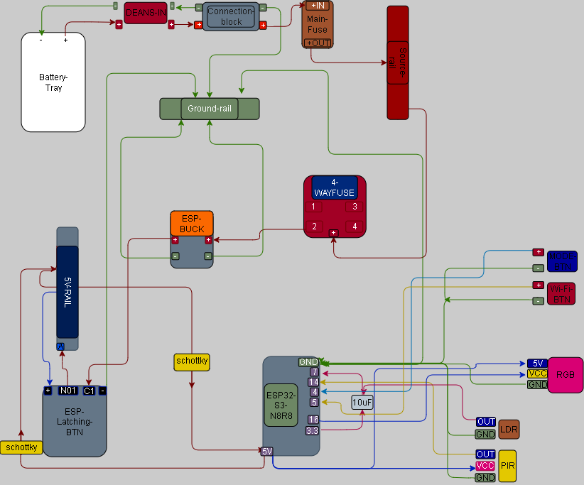

# ENZO V1 Wiring Reference

## Purpose
This page uses a single combined V1 diagram.

Both the **power architecture** and the **peripheral wiring** can be seen in this one reference image.

It is intended to give a clear V1 view of:
- how ENZO is powered and distributed safely
- what connects to the ESP32-S3 and where

---

## Combined V1 Wiring / Architecture View
This diagram is based on the physical ENZO wiring and includes some later/as-built hardware detail around the core Free V1 architecture.

For the **required Free V1 build**, follow the BOM and staged Module A / Module B instructions. The 4-way fuse block visible in the diagram is a later/as-built distribution feature and is **not required hardware for Free V1**.

The required Free V1 power architecture remains:

```text
Battery → Fuse → Main Schottky → Source/Input Rail → Buck → Latching Switch → 5V Rail
```

plus the two ESP/5V Schottky isolation channels documented in the dedicated Schottky reference.

The diagram also shows the V1 peripheral connections for:
- MODE button
- Wi-Fi button
- RGB / NeoPixel eyes
- LDR
- PIR

This answers:

**How is ENZO wired, and how is V1 powered?**



---

## Usage Rule
Use the **BOM + Module A + Module B** as the authority for what a Free V1 builder must install.

Use this image as a combined physical reference. Any extra distribution hardware visible in the image that is not listed in the Free V1 BOM or staged modules should be treated as historical/as-built detail, not a mandatory Free V1 component.

It is a V1 reference and is not intended to make later/as-built extras into V1 Free requirements.
