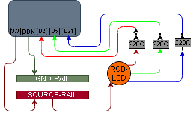

# 001 – RGB LED (3 Channel Output)

## What this does
Drives an RGB LED as three separate output channels using an ESP32.

## What this teaches
- GPIO outputs
- one resistor per channel (don’t skip this)
- how a common-anode RGB LED actually behaves
- mapping real wiring to working code

## Parts
- ESP32
- RGB LED (common anode)
- 3 × 220Ω resistors
- breadboard
- jumper wires

## Wiring
- ESP32 3.3V → **SOURCE RAIL**
- ESP32 GND → **GND RAIL** (not used yet, but added for clarity and next steps)

- RGB LED common leg → **SOURCE RAIL**

- Red leg → 220Ω resistor → GPIO2
- Green leg → 220Ω resistor → GPIO5
- Blue leg → 220Ω resistor → GPIO21

## Diagram



The GND rail is shown in the diagram for clarity and for later expansion.
In this first circuit, the RGB LED itself does not use the external GND rail as its return path.
Each GPIO pin acts as the return path when set LOW.

## What’s actually happening
Power comes from the **source rail**, through the LED.

Each GPIO pin then:
- pulls its channel **LOW** to turn it **ON**
- lets it sit **HIGH** to turn it **OFF**

So the current path is:

`3.3V → source rail → LED → resistor → GPIO pin (LOW) → internal ground`

No external ground rail is used in this circuit yet.  
The ESP32 pins act as the return path when set LOW.

## Code

```python
from machine import Pin
import time

red = Pin(2, Pin.OUT)
green = Pin(5, Pin.OUT)
blue = Pin(21, Pin.OUT)

def all_off():
    red.value(1)
    green.value(1)
    blue.value(1)

all_off()

while True:
    red.value(0)
    green.value(1)
    blue.value(1)
    time.sleep(1)

    red.value(1)
    green.value(0)
    blue.value(1)
    time.sleep(1)

    red.value(1)
    green.value(1)
    blue.value(0)
    time.sleep(1)

    all_off()
    time.sleep(1)
```

## Test
You should see:
- red on
- green on
- blue on
- all off
- repeat

## What this enables next
- 002 – RGB Button Cycle
- reacting to input
- simple state logic
