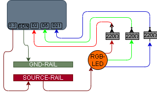

# 001 – RGB LED (3 Channel Output)

## What this does
Drives an RGB LED as three separate output channels using an ESP32.

## What this teaches
- GPIO outputs
- one resistor per channel (don’t skip this)
- how a common-anode RGB LED actually behaves
- mapping real wiring to working code

## Parts
- ESP32
- RGB LED (common anode)
- 3 × 220Ω resistors
- breadboard
- jumper wires

## Wiring
- ESP32 3.3V → **SOURCE RAIL**
- ESP32 GND → **GND RAIL** (not used yet, but added for clarity and next steps)

- RGB LED common leg → **SOURCE RAIL**

- Red leg → 220Ω resistor → GPIO2
- Green leg → 220Ω resistor → GPIO5
- Blue leg → 220Ω resistor → GPIO21

## Wiring Diagram



The GND rail is shown in the diagram for clarity and for later expansion.
In this first circuit, the RGB LED itself does not use the external GND rail as its return path.
Each GPIO pin acts as the return path when set LOW.

## What’s actually happening
Power comes from the **source rail**, through the LED.

Each GPIO pin then:
- pulls its channel **LOW** to turn it **ON**
- lets it sit **HIGH** to turn it **OFF**

So the current path is:

`3.3V → source rail → LED → resistor → GPIO pin (LOW) → internal ground`

The external GND rail is present for clarity and later expansion, but the RGB LED itself does not use it as its return path in this first circuit.
The ESP32 pins act as the return path when set LOW.

## Code

```python
from machine import Pin
import time

red = Pin(2, Pin.OUT)
green = Pin(5, Pin.OUT)
blue = Pin(21, Pin.OUT)

def all_off():
    red.value(1)
    green.value(1)
    blue.value(1)

all_off()

while True:
    red.value(0)
    green.value(1)
    blue.value(1)
    time.sleep(1)

    red.value(1)
    green.value(0)
    blue.value(1)
    time.sleep(1)

    red.value(1)
    green.value(1)
    blue.value(0)
    time.sleep(1)

    all_off()
    time.sleep(1)
```

## Code Explanation

### 1. Output pin setup
The code sets three GPIO pins as outputs:
- GPIO2 for red
- GPIO5 for green
- GPIO21 for blue

Each pin controls one colour channel of the RGB LED.

### 2. Common-anode behaviour
This build uses a **common-anode** RGB LED.
That means:
- the common leg is tied to **3.3V**
- a colour turns **on** when its GPIO pin is driven **LOW**
- a colour turns **off** when its GPIO pin is driven **HIGH**

So the logic is the reverse of what many people expect at first.

### 3. `all_off()`
The function:

```python
all_off()
```

sets all three GPIO pins HIGH.
That turns all three colour channels off.

This gives the script a simple way to return to a clean off state.

### 4. Main loop behaviour
The `while True:` loop runs forever and steps through the colours in order:
- red on
- green on
- blue on
- all off

Each state lasts for one second.

### 5. How one colour turns on
For example:

```python
red.value(0)
green.value(1)
blue.value(1)
```

means:
- red = ON
- green = OFF
- blue = OFF

Because red is pulled LOW, current can flow through that channel.

### 6. What this proves
This module proves that:
- each GPIO output is working
- each resistor/channel is wired correctly
- the RGB LED behaviour is understood properly

That makes it a good first test before adding input or mode logic later.

## Test
You should see:
- red on
- green on
- blue on
- all off
- repeat

## Definition of done
- all three colour channels respond correctly
- the LED cycles red, green, blue, then off
- each colour stays on for about one second
- the LED behaviour matches common-anode logic

## What this enables next
- 002 – RGB Button Cycle
- reacting to input
- simple state logic
