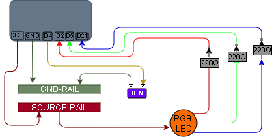

# 002 – RGB LED Button Cycle

## What this does
Cycles an RGB LED through colours using a momentary button.

Each press moves to the next state:

`off → red → green → blue → off`

## What this teaches
- reading digital input (button) using internal pull-up resistors
- basic state tracking
- linking input → logic → output
- controlling multiple GPIO outputs

## Parts
- ESP32
- RGB LED (common anode)
- 3 × 220Ω resistors
- momentary push button
- breadboard
- jumper wires

## Wiring

### RGB LED (output circuit)
- Common leg → 3.3V
- GPIO2 → 220Ω → Red
- GPIO5 → 220Ω → Green
- GPIO21 → 220Ω → Blue

### Button (input circuit)
- GPIO4 → button → GND

## Diagram



## Notes

### RGB behaviour
This LED is wired as common anode, so:
- `0 = ON`
- `1 = OFF`

### Button behaviour
Using internal pull-up:
- not pressed → `1`
- pressed → `0`

You can prove the button behaviour directly in the REPL with:

```python
from machine import Pin
import time

btn = Pin(4, Pin.IN, Pin.PULL_UP)

while True:
    print(btn.value())
    time.sleep(0.2)
```

Expected result:
- `1` when the button is not pressed
- `0` when the button is pressed

The button does not carry LED current.
It only provides a signal to the ESP.

## Code

```python
from machine import Pin
import time

red = Pin(2, Pin.OUT)
green = Pin(5, Pin.OUT)
blue = Pin(21, Pin.OUT)

button = Pin(4, Pin.IN, Pin.PULL_UP)

state = 0
last = 1

def all_off():
    red.value(1)
    green.value(1)
    blue.value(1)

def set_state(s):
    all_off()

    if s == 1:
        red.value(0)
    elif s == 2:
        green.value(0)
    elif s == 3:
        blue.value(0)
    # state 0 = off

all_off()

while True:
    current = button.value()

    if last == 1 and current == 0:
        state += 1
        if state > 3:
            state = 0

        set_state(state)

    last = current
    time.sleep(0.05)

```

## Test
- power on → LED off
- press button once → red
- press again → green
- press again → blue
- press again → off
- holding the button should not rapidly cycle

## What this enables next
- multi-button control
- long press vs short press
- adding sensors as inputs
- building larger state-driven behaviour

## Summary
This circuit introduces a basic control loop:

`button → code → state → LED`

This is the foundation of interactive systems.
