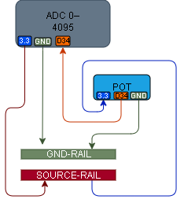

# 003 – Potentiometer Input

## What this does
Reads a changing analog value from a potentiometer using ESP32 ADC.

## What this teaches
- analog input
- ADC reading
- variable voltage
- physical direction vs reading direction

## Parts
- ESP32
- potentiometer
- breadboard
- jumper wires

## Wiring
Facing the potentiometer:
- left leg → 3.3V
- middle leg → GPIO34
- right leg → GND

## Diagram



## Notes
Observed behaviour:
- turn right / clockwise → reading decreases toward 0
- turn left / anticlockwise → reading increases toward 4095

## Code

```python
from machine import ADC, Pin
import time

pot = ADC(Pin(34))
pot.atten(ADC.ATTN_11DB)

while True:
    print(pot.read())
    time.sleep(0.2)
```

## Test
- turn the potentiometer fully one way
- confirm values move toward 0
- turn it the other way
- confirm values move toward 4095

## What this enables next
- 004 – Pot controls RGB
- later: pot controls servo
