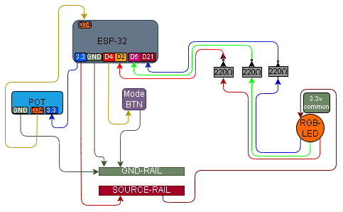

# 005 – Button Changes Colour Mode, Pot Controls Brightness

## What this does
Uses a button to change the active RGB colour mode, while a potentiometer controls the brightness of the currently selected colour.

On startup the circuit begins in red mode.
Each button press cycles:

`red → green → blue → red`

The potentiometer then changes the brightness of whichever colour is currently selected.

## What this teaches
- PWM output
- state selection by button
- analog input controlling intensity
- multiple inputs controlling one output system

## Parts
- ESP32
- RGB LED (common anode)
- 3 × 220Ω resistors
- momentary push button
- potentiometer
- breadboard
- jumper wires

## Wiring
Keep the physical wiring the same as 004 and 002 combined.

### RGB
- common leg → 3.3V
- red leg → 220Ω → GPIO2
- green leg → 220Ω → GPIO5
- blue leg → 220Ω → GPIO21

### Button
- GPIO4 → button → GND

### Potentiometer
- left leg → 3.3V
- middle leg → GPIO34
- right leg → GND

No need to change the board if it is already wired like that.

## Wiring Diagram



## Important New concept
This is the first time PWM is used on the RGB outputs instead of plain `Pin.OUT`.

So instead of plain output objects like:

```python
red = Pin(2, Pin.OUT)
green = Pin(5, Pin.OUT)
blue = Pin(21, Pin.OUT)
```

you now use PWM objects instead:

```python
red = PWM(Pin(2), freq=1000)
green = PWM(Pin(5), freq=1000)
blue = PWM(Pin(21), freq=1000)
```

That lets you control brightness, not just on/off state.

## Notes
This RGB LED is common anode, so PWM behaviour is inverted:
- `0` = fully on
- `65535` = fully off

That is why the code flips the potentiometer mapping.

### Practical note
This version uses a simple button edge check and may still show occasional switch bounce on some buttons.

If a single press ever skips colours or double-triggers, the wiring is not necessarily wrong — the button may just need basic debounce handling in code.

## Code

```python
from machine import Pin, ADC, PWM
import time

# PWM outputs for common-anode RGB LED
red = PWM(Pin(2), freq=1000)
green = PWM(Pin(5), freq=1000)
blue = PWM(Pin(21), freq=1000)

# Button input
button = Pin(4, Pin.IN, Pin.PULL_UP)

# Potentiometer input
pot = ADC(Pin(34))
pot.atten(ADC.ATTN_11DB)

mode = 0      # 0=red, 1=green, 2=blue
last = 1

def all_off():
    red.duty_u16(65535)
    green.duty_u16(65535)
    blue.duty_u16(65535)

def set_mode_brightness(mode, value):
    # map 0–4095 to 65535–0 because common-anode is active-low
    duty = 65535 - int((value / 4095) * 65535)

    all_off()

    if mode == 0:
        red.duty_u16(duty)
    elif mode == 1:
        green.duty_u16(duty)
    elif mode == 2:
        blue.duty_u16(duty)

all_off()

while True:
    current = button.value()

    if last == 1 and current == 0:
        mode += 1
        if mode > 2:
            mode = 0

    last = current

    value = pot.read()
    set_mode_brightness(mode, value)

    print("mode:", mode, "pot:", value)
    time.sleep(0.05)
```

## What to expect
### On startup
- red mode active

### Pot turn
- current colour gets brighter / dimmer

### Button press
- switches to next colour mode
- the potentiometer now controls that colour instead

## Definition of done for 005
- button cycles red / green / blue
- potentiometer changes brightness of selected colour
- all three modes work reliably

## What this enables next
- richer PWM output control
- smoother colour behaviour
- later: mixed-colour control and more advanced output logic
