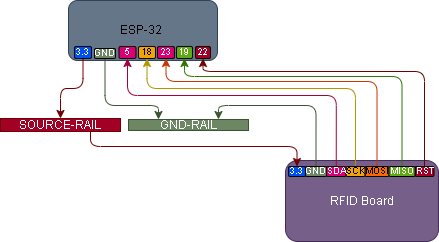

# 006 – RFID Tag Read

## What this does
Reads RFID cards and fobs with an RC522 reader and prints their UID to the ESP32 serial output.

## What this teaches
- SPI wiring
- using a driver file on the MicroPython device
- reading RFID tags and cards
- recording UIDs for later builds
- preparing data for access control logic

## Parts
- ESP32
- RC522 RFID reader
- RFID card
- RFID fob
- jumper wires
- breadboard

## Wiring
RC522 → ESP32
- SDA → GPIO5
- SCK → GPIO18
- MOSI → GPIO23
- MISO → GPIO19
- RST → GPIO22
- 3.3V → 3.3V
- GND → GND
- IRQ → not connected

## Wiring Diagram



## Important
The RC522 must be powered from **3.3V**, not 5V.

The `mfrc522.py` driver file must be saved onto the **MicroPython device** before running the RFID read script.

## Driver setup
- create or open `mfrc522.py`
- save it to the **MicroPython device**
- confirm the file exists on the device filesystem
- then run the RFID read script

### Practical note
If the script says it cannot import `mfrc522`, the driver file is either missing from the MicroPython device or saved in the wrong place.

## Notes
The RC522 detected both the card and the fob correctly.

Each tag or card presents a UID.
That UID can be recorded and used later for access checks, matching, or mode changes.

## Read script

```python
from mfrc522 import MFRC522
import time

rdr = MFRC522(sck=18, mosi=23, miso=19, rst=22, cs=5)

print("RFID ready")

while True:
    stat, _ = rdr.request(rdr.REQIDL)

    if stat == rdr.OK:
        stat, raw_uid = rdr.anticoll()
        if stat == rdr.OK:
            print("UID:", raw_uid)
            time.sleep(1)

    time.sleep(0.1)
```

## Driver file (must be on the MicroPython device)
Save this as `mfrc522.py` on the microcontroller:

```python
from machine import Pin, SPI
import time


class MFRC522:
    OK = 0
    NOTAGERR = 1
    ERR = 2

    REQIDL = 0x26
    REQALL = 0x52
    AUTHENT1A = 0x60
    AUTHENT1B = 0x61

    CommandReg = 0x01
    CommIEnReg = 0x02
    DivIEnReg = 0x03
    CommIrqReg = 0x04
    DivIrqReg = 0x05
    ErrorReg = 0x06
    Status1Reg = 0x07
    Status2Reg = 0x08
    FIFODataReg = 0x09
    FIFOLevelReg = 0x0A
    WaterLevelReg = 0x0B
    ControlReg = 0x0C
    BitFramingReg = 0x0D
    CollReg = 0x0E

    ModeReg = 0x11
    TxModeReg = 0x12
    RxModeReg = 0x13
    TxControlReg = 0x14
    TxASKReg = 0x15
    CRCResultRegH = 0x21
    CRCResultRegL = 0x22
    TModeReg = 0x2A
    TPrescalerReg = 0x2B
    TReloadRegH = 0x2C
    TReloadRegL = 0x2D

    PCD_IDLE = 0x00
    PCD_AUTHENT = 0x0E
    PCD_RECEIVE = 0x08
    PCD_TRANSMIT = 0x04
    PCD_TRANSCEIVE = 0x0C
    PCD_RESETPHASE = 0x0F
    PCD_CALCCRC = 0x03

    PICC_ANTICOLL = 0x93
    PICC_SELECTTAG = 0x93
    PICC_AUTHENT1A = 0x60
    PICC_AUTHENT1B = 0x61
    PICC_READ = 0x30
    PICC_WRITE = 0xA0
    PICC_DECREMENT = 0xC0
    PICC_INCREMENT = 0xC1
    PICC_RESTORE = 0xC2
    PICC_TRANSFER = 0xB0
    PICC_HALT = 0x50

    def __init__(
        self,
        sck=18,
        mosi=23,
        miso=19,
        rst=22,
        cs=5,
        spi_id=1,
        baudrate=1000000,
    ):
        self.cs = Pin(cs, Pin.OUT)
        self.rst = Pin(rst, Pin.OUT)

        self.cs.value(1)
        self.rst.value(1)

        self.spi = SPI(
            spi_id,
            baudrate=baudrate,
            polarity=0,
            phase=0,
            sck=Pin(sck),
            mosi=Pin(mosi),
            miso=Pin(miso),
        )

        self.init()

    def _wreg(self, reg, val):
        self.cs.value(0)
        self.spi.write(bytearray([(reg << 1) & 0x7E]))
        self.spi.write(bytearray([val]))
        self.cs.value(1)

    def _rreg(self, reg):
        self.cs.value(0)
        self.spi.write(bytearray([((reg << 1) & 0x7E) | 0x80]))
        val = self.spi.read(1)
        self.cs.value(1)
        return val[0]

    def _sflags(self, reg, mask):
        self._wreg(reg, self._rreg(reg) | mask)

    def _cflags(self, reg, mask):
        self._wreg(reg, self._rreg(reg) & (~mask))

    def _reset(self):
        self._wreg(self.CommandReg, self.PCD_RESETPHASE)

    def init(self):
        self._reset()
        self._wreg(self.TModeReg, 0x8D)
        self._wreg(self.TPrescalerReg, 0x3E)
        self._wreg(self.TReloadRegL, 30)
        self._wreg(self.TReloadRegH, 0)
        self._wreg(self.TxASKReg, 0x40)
        self._wreg(self.ModeReg, 0x3D)
        self.antenna_on()

    def antenna_on(self, on=True):
        if on and ~(self._rreg(self.TxControlReg) & 0x03):
            self._sflags(self.TxControlReg, 0x03)
        else:
            self._cflags(self.TxControlReg, 0x03)

    def _tocard(self, cmd, send):
        recv = []
        bits = 0
        irq_en = 0x00
        wait_irq = 0x00
        status = self.ERR

        if cmd == self.PCD_AUTHENT:
            irq_en = 0x12
            wait_irq = 0x10
        elif cmd == self.PCD_TRANSCEIVE:
            irq_en = 0x77
            wait_irq = 0x30

        self._wreg(self.CommIEnReg, irq_en | 0x80)
        self._cflags(self.CommIrqReg, 0x80)
        self._sflags(self.FIFOLevelReg, 0x80)
        self._wreg(self.CommandReg, self.PCD_IDLE)

        for c in send:
            self._wreg(self.FIFODataReg, c)

        self._wreg(self.CommandReg, cmd)

        if cmd == self.PCD_TRANSCEIVE:
            self._sflags(self.BitFramingReg, 0x80)

        i = 2000
        while True:
            n = self._rreg(self.CommIrqReg)
            i -= 1
            if not ((i != 0) and not (n & 0x01) and not (n & wait_irq)):
                break

        self._cflags(self.BitFramingReg, 0x80)

        if i != 0:
            if (self._rreg(self.ErrorReg) & 0x1B) == 0x00:
                status = self.OK

                if n & irq_en & 0x01:
                    status = self.NOTAGERR

                if cmd == self.PCD_TRANSCEIVE:
                    n = self._rreg(self.FIFOLevelReg)
                    last_bits = self._rreg(self.ControlReg) & 0x07
                    if last_bits:
                        bits = (n - 1) * 8 + last_bits
                    else:
                        bits = n * 8

                    if n == 0:
                        n = 1
                    if n > 16:
                        n = 16

                    for _ in range(n):
                        recv.append(self._rreg(self.FIFODataReg))
            else:
                status = self.ERR

        return status, recv, bits

    def _crc(self, data):
        self._cflags(self.DivIrqReg, 0x04)
        self._sflags(self.FIFOLevelReg, 0x80)

        for c in data:
            self._wreg(self.FIFODataReg, c)

        self._wreg(self.CommandReg, self.PCD_CALCCRC)

        i = 0xFF
        while True:
            n = self._rreg(self.DivIrqReg)
            i -= 1
            if not ((i != 0) and not (n & 0x04)):
                break

        return [self._rreg(self.CRCResultRegL), self._rreg(self.CRCResultRegH)]

    def request(self, mode):
        self._wreg(self.BitFramingReg, 0x07)
        status, recv, bits = self._tocard(self.PCD_TRANSCEIVE, [mode])

        if (status != self.OK) or (bits != 0x10):
            status = self.ERR

        return status, bits

    def anticoll(self):
        ser_chk = 0
        ser = [self.PICC_ANTICOLL, 0x20]
        self._wreg(self.BitFramingReg, 0x00)

        status, recv, bits = self._tocard(self.PCD_TRANSCEIVE, ser)

        if status == self.OK:
            if len(recv) == 5:
                for i in range(4):
                    ser_chk ^= recv[i]
                if ser_chk != recv[4]:
                    status = self.ERR
            else:
                status = self.ERR

        return status, recv

    def select_tag(self, ser):
        buf = [self.PICC_SELECTTAG, 0x70] + ser[:5]
        buf += self._crc(buf)
        status, recv, bits = self._tocard(self.PCD_TRANSCEIVE, buf)

        if status == self.OK and bits == 0x18:
            return recv[0]
        return 0

    def auth(self, mode, addr, sect, ser):
        return self._tocard(self.PCD_AUTHENT, [mode, addr] + sect + ser[:4])[0]

    def stop_crypto1(self):
        self._cflags(self.Status2Reg, 0x08)

    def halt(self):
        buf = [self.PICC_HALT, 0]
        buf += self._crc(buf)
        self._tocard(self.PCD_TRANSCEIVE, buf)
```

## Test
- power the RC522 from 3.3V
- run the read script
- present the RFID card
- confirm a UID prints to serial
- present the RFID fob
- confirm a UID prints to serial

## What this enables next
- RFID matching
- access control behaviour
- tag-based mode changes
- later: whitelist / deny logic
