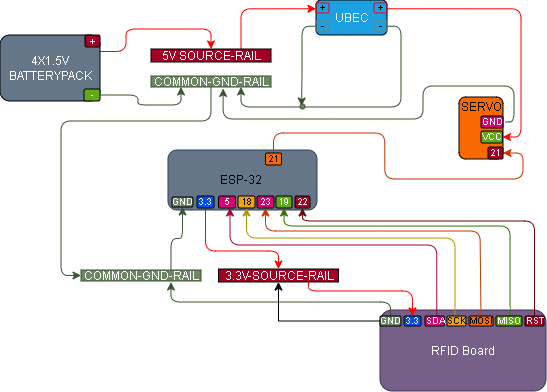

# 008 – RFID Servo Lock

## What this does
Uses an RC522 RFID reader to control a servo lock.

In this build:
- authorised UID → servo unlocks
- when the authorised tag is removed, the servo returns to lock
- unknown UID → no action

## What this teaches
- combining RFID input with motion output
- authorised vs unauthorised logic
- servo position control
- returning to a safe locked state
- using continued RFID presence to hold an unlocked state

## Parts
- ESP32
- RC522 RFID reader
- RFID fob/card
- micro servo
- jumper wires
- breadboard
- 5V supply for the servo

## Important servo note
Do **not** power the servo from 3.3V.

Use:
- servo VCC → 5V
- servo GND → common ground with ESP32
- servo signal → GPIO pin

## Wiring

### RC522 → ESP32
- SDA → GPIO5
- SCK → GPIO18
- MOSI → GPIO23
- MISO → GPIO19
- RST → GPIO22
- 3.3V → 3.3V
- GND → GND
- IRQ → not connected

### Servo
- signal → GPIO21
- VCC → 5V
- GND → GND

## Wiring Diagram



## Important UID note
Before using this module, run [006 – RFID Tag Read](../006_rfid_tag_read/README.md) first to read the UID values from your own card or fob.

The `AUTHORIZED_UID` shown in the code below is only an example from this build.
Replace it with the UID from your own authorised tag or card.

## Behaviour
- authorised UID present → servo unlocks
- authorised UID removed → servo returns to lock after a short delay
- unknown UID → no action

## Code

```python
from machine import Pin, PWM
from mfrc522 import MFRC522
import time

# ----------------------------
# RFID reader
# ----------------------------
rdr = MFRC522(sck=18, mosi=23, miso=19, rst=22, cs=5)

# ----------------------------
# Authorised UID
# ----------------------------
# Change these digits to match your own authorised tag or fob UID
AUTHORIZED_UID = [35, 166, 153, 13, 17]

# ----------------------------
# Servo on GPIO21
# ----------------------------
servo = PWM(Pin(21), freq=50)

def set_servo_angle(angle):
    # SG90-style 50Hz servo pulse range
    min_duty = 1638
    max_duty = 8192
    duty = int(min_duty + (angle / 180) * (max_duty - min_duty))
    servo.duty_u16(duty)

LOCK_ANGLE = 0
UNLOCK_ANGLE = 90

# start locked
set_servo_angle(LOCK_ANGLE)

print("RFID servo lock ready")

# ----------------------------
# State tracking
# ----------------------------
unlocked = False
last_seen_time = 0
HOLD_MS = 1200   # how long after last authorised read before re-locking

try:
    while True:
        stat, _ = rdr.request(rdr.REQIDL)

        if stat == rdr.OK:
            stat, raw_uid = rdr.anticoll()

            if stat == rdr.OK:
                print("UID:", raw_uid)

                if raw_uid == AUTHORIZED_UID:
                    last_seen_time = time.ticks_ms()

                    if not unlocked:
                        print("AUTHORISED -> UNLOCK")
                        set_servo_angle(UNLOCK_ANGLE)
                        unlocked = True
                else:
                    print("UNKNOWN -> NO ACTION")

        # if authorised tag is no longer being seen, lock again
        if unlocked:
            now = time.ticks_ms()
            if time.ticks_diff(now, last_seen_time) > HOLD_MS:
                print("TAG REMOVED -> LOCK")
                set_servo_angle(LOCK_ANGLE)
                unlocked = False

        time.sleep(0.1)

finally:
    set_servo_angle(LOCK_ANGLE)
    servo.deinit()

```

## What to expect
- blue fob presented → servo unlocks
- keep blue fob present → servo stays unlocked
- remove blue fob → servo locks after a short delay
- white card → prints unknown, servo does nothing

## Definition of done
- RFID reads authorised UID
- servo unlocks on authorised scan
- servo re-locks after tag removal
- unknown card does nothing

## Notes
If the servo twitches or behaves badly, likely causes are:
- bad power
- no common ground
- lock/unlock angles need tuning

If it moves the wrong way:
- swap `LOCK_ANGLE` and `UNLOCK_ANGLE`
- or tune `90` to something like `60` or `120`

Some servos do not map perfectly to `0` and `90` degrees in real builds.
If the lock does not sit correctly, tune `LOCK_ANGLE` and `UNLOCK_ANGLE` to match your mechanism.
