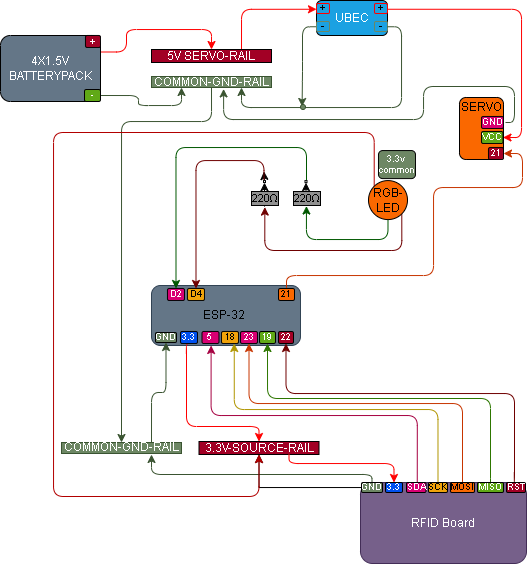

# 009 – RFID Servo Lock with Status RGB

## What this does
Combines RFID access checking, RGB status indication, and servo lock control in one build.

In this build:
- authorised RFID fob or card → green status + servo unlock
- remove the authorised fob or card → servo returns to lock
- unknown card or fob → red status + no servo movement

## What this teaches
- combining multiple outputs from one RFID decision
- using RFID to control both visual state and physical motion
- keeping servo power separate from the ESP32 3.3V rail
- maintaining a common ground across mixed-voltage parts
- building a simple access-control system

## Parts
- ESP32
- RC522 RFID reader
- RFID fob
- RFID card
- RGB LED (common anode)
- 2 × 220Ω resistors
- micro servo
- UBEC / 5V regulator for servo power
- 4 × 1.5V battery pack
- jumper wires
- breadboard

## Important
The RC522 must be powered from **3.3V**, not 5V.

The servo must be powered from a separate **5V supply**, not from the ESP32 3.3V pin.

In this build, the **UBEC / 5V regulator** provides the servo power rail.
The battery pack feeds the UBEC, and the UBEC provides a stable 5V output for the servo.

The servo ground, RC522 ground, battery / UBEC ground, and ESP32 ground must all be connected together.

The `mfrc522.py` driver file must already be saved onto the **MicroPython device** before running this script.

This RGB LED is common anode, so:
- `0` = channel ON
- `1` = channel OFF

## Wiring

### RC522 → ESP32
- SDA → GPIO5
- SCK → GPIO18
- MOSI → GPIO23
- MISO → GPIO19
- RST → GPIO22
- 3.3V → 3.3V
- GND → common ground
- IRQ → not connected

### Servo
- signal → GPIO21
- VCC → UBEC 5V output
- GND → common ground

### Status LED
This build uses red and green only.

- RGB common leg → 3.3V
- red leg → 220Ω → GPIO4
- green leg → 220Ω → GPIO2
- blue leg → not connected

### Power
- ESP32 and RC522 are powered from USB / ESP32 3.3V side
- servo is powered separately from the battery pack through the UBEC
- all grounds are tied together through the common ground rail

## Wiring Diagram



## Important UID note
Before using this module, run [006 – RFID Tag Read](../006_rfid_tag_read/README.md) first to read the UID values from your own card or fob.

The `AUTHORIZED_UID` shown in the code below is only an example from this build.
Replace it with the UID from your own authorised tag or card.

## Behaviour
- authorised UID present → green turns on and the servo unlocks
- keep the authorised UID present → the lock stays open
- authorised UID removed → servo returns to lock and the LED returns to off
- unknown UID → red shows briefly and the servo does not move

## Code

```python
from machine import Pin, PWM
from mfrc522 import MFRC522
import time

# ----------------------------
# Status LED (common anode RGB, red + green only)
# ----------------------------
red = Pin(4, Pin.OUT)
green = Pin(2, Pin.OUT)

def led_off():
    red.value(1)
    green.value(1)

def show_red():
    red.value(0)
    green.value(1)

def show_green():
    red.value(1)
    green.value(0)

led_off()

# ----------------------------
# RFID reader
# ----------------------------
rdr = MFRC522(sck=18, mosi=23, miso=19, rst=22, cs=5)

# Change these digits to match your own authorised tag or fob UID
AUTHORIZED_UID = [35, 166, 153, 13, 17]

# ----------------------------
# Servo
# ----------------------------
servo = PWM(Pin(21), freq=50)

def set_servo_angle(angle):
    min_duty = 1638
    max_duty = 8192
    duty = int(min_duty + (angle / 180) * (max_duty - min_duty))
    servo.duty_u16(duty)

LOCK_ANGLE = 0
UNLOCK_ANGLE = 90

set_servo_angle(LOCK_ANGLE)

print("RFID servo lock with status ready")

unlocked = False
last_seen_time = 0
HOLD_MS = 1200

try:
    while True:
        stat, _ = rdr.request(rdr.REQIDL)

        if stat == rdr.OK:
            stat, raw_uid = rdr.anticoll()

            if stat == rdr.OK:
                print("UID:", raw_uid)

                if raw_uid == AUTHORIZED_UID:
                    last_seen_time = time.ticks_ms()

                    if not unlocked:
                        print("AUTHORISED -> GREEN + UNLOCK")
                        show_green()
                        set_servo_angle(UNLOCK_ANGLE)
                        unlocked = True
                else:
                    print("UNKNOWN -> RED")
                    show_red()
                    time.sleep(1.0)
                    led_off()

        if unlocked:
            now = time.ticks_ms()
            if time.ticks_diff(now, last_seen_time) > HOLD_MS:
                print("TAG REMOVED -> LOCK")
                set_servo_angle(LOCK_ANGLE)
                led_off()
                unlocked = False

        time.sleep(0.1)

finally:
    led_off()
    set_servo_angle(LOCK_ANGLE)
    servo.deinit()
```

## What to expect
- authorised fob or card presented → green turns on and the servo unlocks
- keep the authorised fob or card present → the lock stays open
- remove the authorised fob or card → the servo locks and the LED returns to off
- unknown tag or card → red shows briefly and the servo does not move

## Definition of done
- RFID reads the authorised UID
- green status shows on authorised access
- servo unlocks on authorised access
- servo re-locks after the authorised tag is removed
- unknown tag or card shows red and does not move the servo

## Notes
This build uses:
- green to indicate authorised
- red to indicate unknown / denied

If the servo twitches or behaves badly, likely causes are:
- bad power
- no common ground
- lock/unlock angles need tuning

If it moves the wrong way:
- swap `LOCK_ANGLE` and `UNLOCK_ANGLE`
- or tune `90` to something like `60` or `120`

If the lock stays open for too long or closes too quickly after tag removal, tune `HOLD_MS` to suit your build.

## What this enables next
- combined access-control behaviour
- richer lock status feedback
- later: timed unlock, multi-tag handling, or full latch mechanisms
