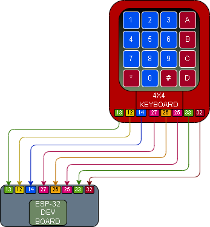

# 010 – Keypad Read

## What this does
Reads key presses from a 4x4 membrane keypad and prints the pressed key to the ESP32 serial output.

## What this teaches
- matrix keypad input
- using multiple GPIO pins together
- reading row and column states
- mapping hardware input to readable key values

## Parts
- ESP32 dev board
- 4x4 membrane keypad
- jumper wires
- breadboard

## Wiring
This build uses 8 direct signal wires from the keypad to the ESP32.

### Keypad → ESP32
- pin 1 → GPIO13
- pin 2 → GPIO12
- pin 3 → GPIO14
- pin 4 → GPIO27
- pin 5 → GPIO26
- pin 6 → GPIO25
- pin 7 → GPIO33
- pin 8 → GPIO32

## Wiring Diagram




The keypad reads all keys normally:
- `1 2 3 A`
- `4 5 6 B`
- `7 8 9 C`
- `* 0 # D`

## Code

```python
from machine import Pin
import time

row_pins = [Pin(13, Pin.OUT), Pin(12, Pin.OUT), Pin(14, Pin.OUT), Pin(27, Pin.OUT)]
col_pins = [Pin(26, Pin.IN, Pin.PULL_DOWN),
            Pin(25, Pin.IN, Pin.PULL_DOWN),
            Pin(33, Pin.IN, Pin.PULL_DOWN),
            Pin(32, Pin.IN, Pin.PULL_DOWN)]

keys = [
    ["1", "2", "3", "A"],
    ["4", "5", "6", "B"],
    ["7", "8", "9", "C"],
    ["*", "0", "#", "D"]
]

def scan_keypad():
    for r in range(4):
        for row in row_pins:
            row.value(0)
        row_pins[r].value(1)
        time.sleep_us(50)

        for c in range(4):
            if col_pins[c].value():
                return keys[r][c]
    return None

last_key = None
print("Keypad ready")

while True:
    key = scan_keypad()

    if key is not None and key != last_key:
        print("Pressed:", key)
        last_key = key

    if key is None:
        last_key = None

    time.sleep(0.1)
```

## Test
- wire the keypad exactly as shown
- save and run the script on the ESP32
- open the serial output
- press each key one by one
- confirm the correct key value is printed
- check that all 16 keys read correctly

## What this enables next
- keypad-driven input
- PIN entry systems
- keypad + display projects
- combining keypad input with other modules
