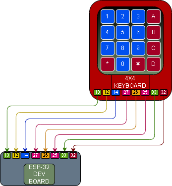

# 012 – Keypad Password Check

## What this does
Uses a 4x4 membrane keypad to enter a fixed password and check whether it is correct.

In this build:
- keypad presses are read
- `*` clears the current entry
- `#` submits the current entry
- correct password = success
- wrong password = denied

## What this teaches
- storing keypad input
- building a string from multiple key presses
- clearing input
- submitting input for checking
- simple password / PIN logic

## Parts
- ESP32 dev board
- 4x4 membrane keypad
- jumper wires
- breadboard

## Wiring
This module reuses the keypad wiring from **010 – Keypad Read**.

### Keypad → ESP32
- pin 1 → GPIO13
- pin 2 → GPIO12
- pin 3 → GPIO14
- pin 4 → GPIO27
- pin 5 → GPIO26
- pin 6 → GPIO25
- pin 7 → GPIO33
- pin 8 → GPIO32

## Wiring Diagram



## Notes
This module uses the same hardware wiring as 010.

The output for this version is shown in the REPL / serial output, not on a display.

Password used in this build:
- `1234`

Key behaviour:
- `*` clears the current entry
- `#` submits the current entry for checking

## Code

```python
from machine import Pin
import time

row_pins = [Pin(13, Pin.OUT), Pin(12, Pin.OUT), Pin(14, Pin.OUT), Pin(27, Pin.OUT)]
col_pins = [
    Pin(26, Pin.IN, Pin.PULL_DOWN),
    Pin(25, Pin.IN, Pin.PULL_DOWN),
    Pin(33, Pin.IN, Pin.PULL_DOWN),
    Pin(32, Pin.IN, Pin.PULL_DOWN),
]

keys = [
    ["1", "2", "3", "A"],
    ["4", "5", "6", "B"],
    ["7", "8", "9", "C"],
    ["*", "0", "#", "D"]
]

PASSWORD = "1234"
entry = ""

def scan_keypad():
    for r in range(4):
        for row in row_pins:
            row.value(0)

        row_pins[r].value(1)
        time.sleep_us(50)

        for c in range(4):
            if col_pins[c].value():
                return keys[r][c]

    return None

last_key = None

print("Keypad password check ready")
print("Use * to clear, # to submit")

while True:
    key = scan_keypad()

    if key is not None and key != last_key:
        print("Pressed:", key)

        if key == "*":
            entry = ""
            print("CLEARED")

        elif key == "#":
            if entry == PASSWORD:
                print("ACCESS OK")
            else:
                print("DENIED")
            entry = ""

        else:
            entry += key
            print("ENTRY:", entry)

        last_key = key

    if key is None:
        last_key = None

    time.sleep(0.1)
```

## Code Explanation

### 1. Keypad setup
The code defines:
- four row pins
- four column pins
- the 4x4 keypad layout

The `keys` list is the map that turns a physical key press into a readable value such as `1`, `5`, `*`, or `#`.

### 2. Password and entry storage
The password is stored as:

```python
PASSWORD = "1234"
```

The variable `entry` stores whatever has been typed so far.
As keys are pressed, the code builds up that string one character at a time.

### 3. Reading the keypad
The `scan_keypad()` function checks one row at a time and then looks for a high column.

That lets the ESP32 work out which key is being pressed without needing one GPIO per button.

### 4. Main loop behaviour
The script runs in a continuous loop and checks for key presses over and over.

When a new key is detected, it prints the key to the serial output and then decides what to do with it.

### 5. `*` behaviour
If the key is `*`:
- the current entry is cleared
- `CLEARED` is printed

That gives a quick way to restart the entry.

### 6. `#` behaviour
If the key is `#`:
- the current entry is compared with the password
- if it matches, the script prints `ACCESS OK`
- if it does not match, the script prints `DENIED`
- the entry is then cleared ready for the next try

### 7. Normal key behaviour
If the key is not `*` or `#`, it is treated as part of the password entry.
The key is added to the `entry` string and the current value is printed.

That lets the user build a multi-digit code one key at a time.

### 8. Repeating loop and held keys
The variable `last_key` is used to stop one held press from being counted repeatedly.

That makes the keypad behaviour cleaner and avoids duplicate characters from a slightly long press.

## Test
- wire the keypad exactly as in 010
- run the script
- press keys and confirm they are added to the entry
- press `*` and confirm the entry clears
- enter `1234` and press `#`
- confirm `ACCESS OK`
- enter a wrong code and press `#`
- confirm `DENIED`

## Definition of done
- keypad reads correctly
- entry builds correctly
- `*` clears the input
- `#` submits the input
- correct password = success
- wrong password = fail

## What this enables next
- keypad + LCD entry display
- keypad servo lock
- keypad + LCD password lock
