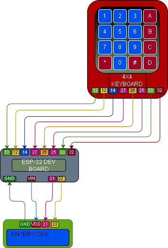

# 013 – Keypad LCD Entry Display

## What this does
Uses a 4x4 membrane keypad and a 1602 I2C LCD together so key presses build an entry string on the display.

In this build:
- keypad presses are read
- typed keys appear on the LCD
- `*` clears the current entry
- `#` shows the entered value on the LCD and prints it to serial

## What this teaches
- combining keypad input with LCD output
- showing live user input on a display
- building a string from multiple key presses
- clearing input
- submitting input
- combining two earlier modules into one working system

## Parts
- ESP32 dev board
- 4x4 membrane keypad
- 1602 I2C LCD
- jumper wires
- breadboard

## Wiring

### LCD → ESP32
- GND → GND
- VDD / VCC → VIN
- SDA → GPIO21
- SCL → GPIO22

### Keypad → ESP32
- pin 1 → GPIO13
- pin 2 → GPIO12
- pin 3 → GPIO14
- pin 4 → GPIO27
- pin 5 → GPIO26
- pin 6 → GPIO25
- pin 7 → GPIO33
- pin 8 → GPIO32

## Wiring Diagram



## Important
Before using this module:
- confirm the LCD works first with [011 – LCD Hello](../011_lcd_hello/README.md)
- confirm the keypad works first with [010 – Keypad Read](../010_keypad_read/README.md)

This build uses the same LCD and keypad wiring already proven in those earlier modules.

The LCD address used here is `0x27`, which matched the scanned address in this build.

## Notes
This module combines the working hardware from 010 and 011.

Display behaviour:
- line 1 shows `ENTER CODE`
- line 2 shows the current entry

Key behaviour:
- `*` clears the current entry
- `#` submits the current entry
- submitted text is shown on the LCD and also printed to serial

## Code

```python
from machine import Pin, I2C
from time import sleep_ms, sleep_us

# ----------------------------
# LCD setup
# ----------------------------
I2C_ADDR = 0x27
LCD_WIDTH = 16
LCD_CHR = 1
LCD_CMD = 0

LCD_LINE_1 = 0x80
LCD_LINE_2 = 0xC0

LCD_BACKLIGHT = 0x08
ENABLE = 0b00000100

i2c = I2C(0, scl=Pin(22), sda=Pin(21), freq=400000)

def lcd_write(bits, mode):
    high = mode | (bits & 0xF0) | LCD_BACKLIGHT
    low = mode | ((bits << 4) & 0xF0) | LCD_BACKLIGHT
    i2c.writeto(I2C_ADDR, bytes([high]))
    lcd_toggle_enable(high)
    i2c.writeto(I2C_ADDR, bytes([low]))
    lcd_toggle_enable(low)

def lcd_toggle_enable(bits):
    sleep_ms(1)
    i2c.writeto(I2C_ADDR, bytes([bits | ENABLE]))
    sleep_ms(1)
    i2c.writeto(I2C_ADDR, bytes([bits & ~ENABLE]))
    sleep_ms(1)

def lcd_init():
    lcd_write(0x33, LCD_CMD)
    lcd_write(0x32, LCD_CMD)
    lcd_write(0x06, LCD_CMD)
    lcd_write(0x0C, LCD_CMD)
    lcd_write(0x28, LCD_CMD)
    lcd_write(0x01, LCD_CMD)
    sleep_ms(5)

def lcd_string(message, line):
    message = str(message)
    message = message + (" " * (LCD_WIDTH - len(message)))
    message = message[:LCD_WIDTH]
    lcd_write(line, LCD_CMD)
    for char in message:
        lcd_write(ord(char), LCD_CHR)

# ----------------------------
# Keypad setup
# ----------------------------
row_pins = [Pin(13, Pin.OUT), Pin(12, Pin.OUT), Pin(14, Pin.OUT), Pin(27, Pin.OUT)]
col_pins = [
    Pin(26, Pin.IN, Pin.PULL_DOWN),
    Pin(25, Pin.IN, Pin.PULL_DOWN),
    Pin(33, Pin.IN, Pin.PULL_DOWN),
    Pin(32, Pin.IN, Pin.PULL_DOWN),
]

keys = [
    ["1", "2", "3", "A"],
    ["4", "5", "6", "B"],
    ["7", "8", "9", "C"],
    ["*", "0", "#", "D"]
]

def scan_keypad():
    for r in range(4):
        for row in row_pins:
            row.value(0)

        row_pins[r].value(1)
        sleep_us(50)

        for c in range(4):
            if col_pins[c].value():
                return keys[r][c]

    return None

# ----------------------------
# Main
# ----------------------------
entry = ""
last_key = None

lcd_init()
lcd_string("ENTER CODE", LCD_LINE_1)
lcd_string("", LCD_LINE_2)

print("Keypad LCD entry ready")
print("* clears, # submits")

while True:
    key = scan_keypad()

    if key is not None and key != last_key:
        print("Pressed:", key)

        if key == "*":
            entry = ""
            lcd_string("ENTER CODE", LCD_LINE_1)
            lcd_string("", LCD_LINE_2)

        elif key == "#":
            lcd_string("ENTERED", LCD_LINE_1)
            lcd_string(entry, LCD_LINE_2)
            print("ENTERED:", entry)

        else:
            entry += key
            lcd_string("ENTER CODE", LCD_LINE_1)
            lcd_string(entry, LCD_LINE_2)

        last_key = key

    if key is None:
        last_key = None

    sleep_ms(100)
```

## Test
- wire the LCD and keypad exactly as shown
- run the script
- confirm the LCD shows `ENTER CODE`
- press keypad buttons and confirm they appear on line 2
- press `*` and confirm the entry clears
- enter a short code and press `#`
- confirm the LCD shows `ENTERED`
- confirm the entered value is also printed to serial

## Definition of done
- LCD initialises correctly
- keypad reads correctly
- typed keys appear on the LCD
- `*` clears the display entry
- `#` shows the submitted entry
- submitted value also prints to serial

## What this enables next
- keypad + LCD password lock
- keypad menu systems
- entry confirmation screens
- keypad-controlled projects with visible user feedback
