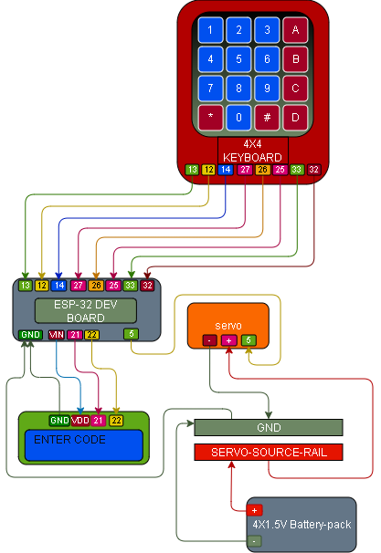

# 014 – Keypad LCD Servo Lock

## What this does
Uses a 4x4 membrane keypad, a 1602 I2C LCD, and a servo together to make a simple password-controlled lock.

In this build:
- keypad presses are read
- typed keys appear on the LCD
- `*` clears the current entry
- `#` submits the current entry
- correct password = servo unlocks briefly, then locks again
- wrong password = denied on the LCD

## What this teaches
- combining keypad input, LCD output, and servo motion
- using a fixed password to control a physical action
- clearing input and submitting for checking
- driving a servo from a keypad decision
- keeping the servo power separate from the ESP32 logic side
- using a common ground across mixed-voltage parts

## Parts
- ESP32 dev board
- 4x4 membrane keypad
- 1602 I2C LCD
- micro servo
- 4× 1.5V battery pack
- 5V servo rail / source rail
- jumper wires
- breadboard

## Wiring

### Keypad → ESP32
- pin 1 → GPIO13
- pin 2 → GPIO12
- pin 3 → GPIO14
- pin 4 → GPIO27
- pin 5 → GPIO26
- pin 6 → GPIO25
- pin 7 → GPIO33
- pin 8 → GPIO32

### LCD → ESP32
- GND → GND
- VDD / VCC → VIN
- SDA → GPIO21
- SCL → GPIO22

### Servo
- signal → GPIO5
- power → 5V servo rail
- ground → common ground

## Wiring Diagram



## Important
Servo signal for this build is **GPIO5**.

The servo must be powered from the separate **5V servo rail**, not from the ESP32 3.3V pin.

The servo ground, battery ground, LCD ground, and ESP32 ground must all share the same common ground.

The LCD address used here is `0x27`, which matched the display used in this build.

## Notes
This module combines the working hardware from:
- [010 – Keypad Read](../010_keypad_read/README.md)
- [011 – LCD Hello](../011_lcd_hello/README.md)
- servo lock behaviour from the earlier lock modules

Password used in this build:
- `1234`

Behaviour:
- line 1 normally shows `ENTER CODE`
- line 2 shows the current entry
- correct password shows `ACCESS OK`, unlocks for 2 seconds, then locks again
- wrong password shows `DENIED`

## Code

```python
from machine import Pin, PWM, I2C
from time import sleep_ms, sleep_us, sleep

# ----------------------------
# LCD setup
# ----------------------------
I2C_ADDR = 0x27
LCD_WIDTH = 16
LCD_CHR = 1
LCD_CMD = 0

LCD_LINE_1 = 0x80
LCD_LINE_2 = 0xC0

LCD_BACKLIGHT = 0x08
ENABLE = 0b00000100

i2c = I2C(0, scl=Pin(22), sda=Pin(21), freq=400000)

def lcd_write(bits, mode):
    high = mode | (bits & 0xF0) | LCD_BACKLIGHT
    low = mode | ((bits << 4) & 0xF0) | LCD_BACKLIGHT
    i2c.writeto(I2C_ADDR, bytes([high]))
    lcd_toggle_enable(high)
    i2c.writeto(I2C_ADDR, bytes([low]))
    lcd_toggle_enable(low)

def lcd_toggle_enable(bits):
    sleep_ms(1)
    i2c.writeto(I2C_ADDR, bytes([bits | ENABLE]))
    sleep_ms(1)
    i2c.writeto(I2C_ADDR, bytes([bits & ~ENABLE]))
    sleep_ms(1)

def lcd_init():
    lcd_write(0x33, LCD_CMD)
    lcd_write(0x32, LCD_CMD)
    lcd_write(0x06, LCD_CMD)
    lcd_write(0x0C, LCD_CMD)
    lcd_write(0x28, LCD_CMD)
    lcd_write(0x01, LCD_CMD)
    sleep_ms(5)

def lcd_string(message, line):
    message = str(message)
    message = message + (" " * (LCD_WIDTH - len(message)))
    message = message[:LCD_WIDTH]
    lcd_write(line, LCD_CMD)
    for char in message:
        lcd_write(ord(char), LCD_CHR)

# ----------------------------
# Keypad setup
# ----------------------------
row_pins = [Pin(13, Pin.OUT), Pin(12, Pin.OUT), Pin(14, Pin.OUT), Pin(27, Pin.OUT)]
col_pins = [
    Pin(26, Pin.IN, Pin.PULL_DOWN),
    Pin(25, Pin.IN, Pin.PULL_DOWN),
    Pin(33, Pin.IN, Pin.PULL_DOWN),
    Pin(32, Pin.IN, Pin.PULL_DOWN),
]

keys = [
    ["1", "2", "3", "A"],
    ["4", "5", "6", "B"],
    ["7", "8", "9", "C"],
    ["*", "0", "#", "D"]
]

def scan_keypad():
    for r in range(4):
        for row in row_pins:
            row.value(0)

        row_pins[r].value(1)
        sleep_us(50)

        for c in range(4):
            if col_pins[c].value():
                return keys[r][c]

    return None

# ----------------------------
# Servo setup
# ----------------------------
servo = PWM(Pin(5), freq=50)

def set_servo_angle(angle):
    min_duty = 1638
    max_duty = 8192
    duty = int(min_duty + (angle / 180) * (max_duty - min_duty))
    servo.duty_u16(duty)

LOCK_ANGLE = 0
UNLOCK_ANGLE = 90
set_servo_angle(LOCK_ANGLE)

# ----------------------------
# Password logic
# ----------------------------
PASSWORD = "1234"
entry = ""
last_key = None

lcd_init()
lcd_string("ENTER CODE", LCD_LINE_1)
lcd_string("", LCD_LINE_2)

print("Keypad servo lock ready")
print("* clears, # submits")

try:
    while True:
        key = scan_keypad()

        if key is not None and key != last_key:
            print("Pressed:", key)

            if key == "*":
                entry = ""
                lcd_string("ENTER CODE", LCD_LINE_1)
                lcd_string("", LCD_LINE_2)
                print("CLEARED")

            elif key == "#":
                if entry == PASSWORD:
                    print("ACCESS OK -> UNLOCK")
                    lcd_string("ACCESS OK", LCD_LINE_1)
                    lcd_string(entry, LCD_LINE_2)
                    set_servo_angle(UNLOCK_ANGLE)
                    sleep(2)
                    set_servo_angle(LOCK_ANGLE)
                    lcd_string("ENTER CODE", LCD_LINE_1)
                    lcd_string("", LCD_LINE_2)
                    print("LOCKED")
                else:
                    print("DENIED")
                    lcd_string("DENIED", LCD_LINE_1)
                    lcd_string(entry, LCD_LINE_2)
                    sleep(1.5)
                    lcd_string("ENTER CODE", LCD_LINE_1)
                    lcd_string("", LCD_LINE_2)

                entry = ""

            else:
                entry += key
                lcd_string("ENTER CODE", LCD_LINE_1)
                lcd_string(entry, LCD_LINE_2)
                print("ENTRY:", entry)

            last_key = key

        if key is None:
            last_key = None

        sleep_ms(100)

finally:
    set_servo_angle(LOCK_ANGLE)
    servo.deinit()
```

## Test
- wire the keypad, LCD, and servo exactly as shown
- confirm the servo is on the separate 5V servo rail
- confirm all grounds share the same common ground
- run the script
- confirm the LCD shows `ENTER CODE`
- press keys and confirm they appear on line 2
- press `*` and confirm the entry clears
- enter `1234` and press `#`
- confirm `ACCESS OK` shows and the servo unlocks briefly, then locks again
- enter a wrong code and press `#`
- confirm `DENIED` shows and the servo does not unlock

## Definition of done
- keypad reads correctly
- LCD updates correctly
- `*` clears the entry
- `#` submits the entry
- correct password unlocks the servo briefly
- wrong password shows denied
- servo returns to lock after the unlock delay

## What this enables next
- keypad + LCD password systems
- keypad-controlled physical access
- better user feedback on lock state
- later: status RGB, buzzer feedback, or multi-code access
