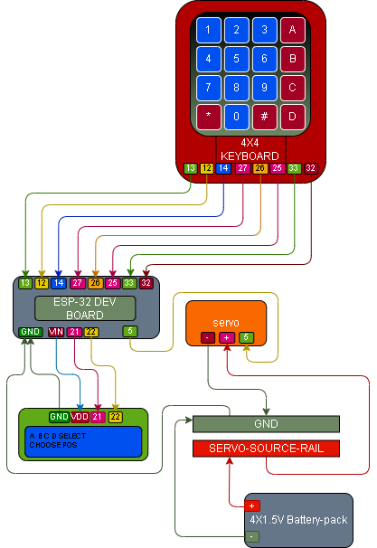

# 015 – Keypad + LCD Multi-Position Lock

## What this does
Uses a 4x4 keypad, a 1602 I2C LCD, and a servo to create a small multi-position control system.

In this build:
- `A / B / C / D` select a target position
- a code must then be entered
- `#` submits the code
- correct code moves the servo to the selected position
- wrong code denies access
- the system then returns to the selection screen

## What this teaches
- menu / option selection
- selected state before code entry
- combining keypad input, LCD output, and servo control
- moving one servo to multiple target positions
- using a code to authorise a chosen action

## Parts
- ESP32 dev board
- 4x4 membrane keypad
- 1602 I2C LCD
- micro servo
- regulated 5V servo rail
- jumper wires
- breadboard

## Wiring

### LCD → ESP32
- GND → GND
- VDD / VCC → VIN
- SDA → GPIO21
- SCL → GPIO22

### Keypad → ESP32
- pin 1 → GPIO13
- pin 2 → GPIO12
- pin 3 → GPIO14
- pin 4 → GPIO27
- pin 5 → GPIO26
- pin 6 → GPIO25
- pin 7 → GPIO33
- pin 8 → GPIO32

### Servo
- signal → GPIO5
- VCC → 5V servo rail
- GND → common ground

## Wiring Diagram



## Important
This module reuses the same physical wiring as 014.

The LCD must already be working as proven in [011 – LCD Hello](../011_lcd_hello/README.md).

The keypad must already be working as proven in [010 – Keypad Read](../010_keypad_read/README.md).

The servo power must come from the separate 5V servo rail, and that ground must be tied back to ESP32 ground.

## Notes
This build starts on a selection screen.

### Selection keys
- `A` = position A
- `B` = position B
- `C` = position C
- `D` = position D

### Entry keys
- `*` = clear current entry
- `#` = submit code

The servo target positions used in this build are:
- `A` → 0°
- `B` → 45°
- `C` → 90°
- `D` → 135°

Password used in this build:
- `1234`

## Code

```python
from machine import Pin, PWM, I2C
from time import sleep_ms, sleep_us, sleep

# ----------------------------
# LCD setup
# ----------------------------
I2C_ADDR = 0x27
LCD_WIDTH = 16
LCD_CHR = 1
LCD_CMD = 0

LCD_LINE_1 = 0x80
LCD_LINE_2 = 0xC0

LCD_BACKLIGHT = 0x08
ENABLE = 0b00000100

i2c = I2C(0, scl=Pin(22), sda=Pin(21), freq=400000)

def lcd_write(bits, mode):
    high = mode | (bits & 0xF0) | LCD_BACKLIGHT
    low = mode | ((bits << 4) & 0xF0) | LCD_BACKLIGHT
    i2c.writeto(I2C_ADDR, bytes([high]))
    lcd_toggle_enable(high)
    i2c.writeto(I2C_ADDR, bytes([low]))
    lcd_toggle_enable(low)

def lcd_toggle_enable(bits):
    sleep_ms(1)
    i2c.writeto(I2C_ADDR, bytes([bits | ENABLE]))
    sleep_ms(1)
    i2c.writeto(I2C_ADDR, bytes([bits & ~ENABLE]))
    sleep_ms(1)

def lcd_init():
    lcd_write(0x33, LCD_CMD)
    lcd_write(0x32, LCD_CMD)
    lcd_write(0x06, LCD_CMD)
    lcd_write(0x0C, LCD_CMD)
    lcd_write(0x28, LCD_CMD)
    lcd_write(0x01, LCD_CMD)
    sleep_ms(5)

def lcd_string(message, line):
    message = str(message)
    message = message + (" " * (LCD_WIDTH - len(message)))
    message = message[:LCD_WIDTH]
    lcd_write(line, LCD_CMD)
    for char in message:
        lcd_write(ord(char), LCD_CHR)

# ----------------------------
# Keypad setup
# ----------------------------
row_pins = [Pin(13, Pin.OUT), Pin(12, Pin.OUT), Pin(14, Pin.OUT), Pin(27, Pin.OUT)]
col_pins = [
    Pin(26, Pin.IN, Pin.PULL_DOWN),
    Pin(25, Pin.IN, Pin.PULL_DOWN),
    Pin(33, Pin.IN, Pin.PULL_DOWN),
    Pin(32, Pin.IN, Pin.PULL_DOWN),
]

keys = [
    ["1", "2", "3", "A"],
    ["4", "5", "6", "B"],
    ["7", "8", "9", "C"],
    ["*", "0", "#", "D"]
]

def scan_keypad():
    for r in range(4):
        for row in row_pins:
            row.value(0)

        row_pins[r].value(1)
        sleep_us(50)

        for c in range(4):
            if col_pins[c].value():
                return keys[r][c]

    return None

# ----------------------------
# Servo setup
# ----------------------------
servo = PWM(Pin(5), freq=50)

def set_servo_angle(angle):
    min_duty = 1638
    max_duty = 8192
    duty = int(min_duty + (angle / 180) * (max_duty - min_duty))
    servo.duty_u16(duty)

POSITIONS = {
    "A": 0,
    "B": 45,
    "C": 90,
    "D": 135,
}

current_position = "A"
set_servo_angle(POSITIONS[current_position])

# ----------------------------
# Password / mode logic
# ----------------------------
PASSWORD = "1234"
entry = ""
last_key = None
selected_position = None
mode = "select"

def show_select_screen():
    lcd_string("A B C D SELECT", LCD_LINE_1)
    lcd_string("CHOOSE POS", LCD_LINE_2)

def show_code_screen(position):
    lcd_string(position + " CODE", LCD_LINE_1)
    lcd_string(entry, LCD_LINE_2)

lcd_init()
show_select_screen()

print("Multi-position lock ready")
print("A/B/C/D select position")
print("* clears/cancels, # submits")

try:
    while True:
        key = scan_keypad()

        if key is not None and key != last_key:
            print("Pressed:", key)

            if mode == "select":
                if key in POSITIONS:
                    selected_position = key
                    entry = ""
                    mode = "code"
                    show_code_screen(selected_position)
                    print("Selected position:", selected_position)

            elif mode == "code":
                if key == "*":
                    if entry == "":
                        selected_position = None
                        mode = "select"
                        show_select_screen()
                        print("Back to selection")
                    else:
                        entry = ""
                        show_code_screen(selected_position)
                        print("CLEARED")

                elif key == "#":
                    if entry == PASSWORD:
                        print("ACCESS OK -> MOVE TO", selected_position)
                        lcd_string("ACCESS OK", LCD_LINE_1)
                        lcd_string("MOVE " + selected_position, LCD_LINE_2)
                        set_servo_angle(POSITIONS[selected_position])
                        sleep(1.5)
                        current_position = selected_position
                    else:
                        print("DENIED")
                        lcd_string("DENIED", LCD_LINE_1)
                        lcd_string(entry, LCD_LINE_2)
                        sleep(1.5)

                    entry = ""
                    selected_position = None
                    mode = "select"
                    show_select_screen()

                else:
                    entry += key
                    show_code_screen(selected_position)
                    print("ENTRY:", entry)

            last_key = key

        if key is None:
            last_key = None

        sleep_ms(100)

finally:
    servo.deinit()
```

## Test
- wire the keypad, LCD, and servo exactly as shown
- run the script
- confirm the LCD shows the selection screen
- press `A`, `B`, `C`, or `D`
- confirm the LCD changes to the matching code-entry screen
- enter `1234`
- press `#`
- confirm the servo moves to the selected position
- enter a wrong code
- confirm the LCD shows `DENIED` and the servo does not move
- press `*` during entry and confirm it clears or returns to selection

## Definition of done
- LCD shows the selection menu
- `A / B / C / D` select a target position
- keypad entry works
- `*` clears or cancels
- `#` submits
- correct code moves the servo to the chosen position
- wrong code denies
- system returns to the selection screen

## What this enables next
- ultrasonic read
- richer menu systems
- multi-state control panels
