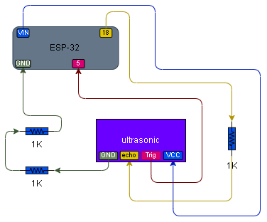

# 016 – Ultrasonic Read

## What this does

Uses an HC-SR04 ultrasonic sensor to measure distance and print the measured value to the serial console.

The ESP32 sends a short trigger pulse to the ultrasonic sensor.
The sensor emits an ultrasonic sound pulse, waits for the echo to return, and then sends a pulse back on the ECHO line.

The ESP32 measures the pulse duration and converts it into a distance reading in centimetres.

---

## What this teaches

* ultrasonic distance sensing
* trigger and echo timing
* pulse measurement
* converting time into distance
* safe voltage division for ESP32 GPIO
* serial monitoring and live sensor testing

---

## Parts

* ESP32 dev board
* HC-SR04 ultrasonic sensor
* 3x 1k resistors
* breadboard
* jumper wires

---

## Wiring

### HC-SR04 → ESP32

* VCC → VIN / 5V
* GND → GND
* TRIG → GPIO5
* ECHO → GPIO18 through resistor divider

### ECHO voltage divider

The HC-SR04 ECHO pin can output around 5V.
The ESP32 GPIO input should remain at 3.3V logic levels.

A resistor divider is therefore used on the ECHO line.

```text
ECHO → 1k resistor → node → GPIO18
node → 2k resistor → GND
```

In this build, the 2k section was created using two 1k resistors in series.

---

## Wiring Diagram



---

## Notes

Distance is measured from the face of the ultrasonic transducers, not from the edge of the breadboard or the wires.

Small differences in measured distance are normal depending on:

* target angle
* surface shape
* object material
* room reflections
* sensor alignment

In this tested build:

* close and medium distance readings were stable
* around 20 cm measured approximately 19.6 cm when aligned carefully
* longer readings became unreliable around roughly 1.2 m to 1.5 m depending on angle and target surface
* beyond that, the module often returned `No echo`

Some HC-SR04 modules are advertised with longer theoretical ranges, but ENZO-Labs only locks behaviour that was physically observed during testing.

---

## Code

```python
from machine import Pin, time_pulse_us
from time import sleep, sleep_us

TRIG_PIN = 5
ECHO_PIN = 18

trig = Pin(TRIG_PIN, Pin.OUT)
echo = Pin(ECHO_PIN, Pin.IN)

trig.value(0)
sleep(1)

print("016 Ultrasonic Read")
print("TRIG = GPIO5")
print("ECHO = GPIO18")
print("Reading distance...")

while True:
    # Send trigger pulse
    trig.value(0)
    sleep_us(2)

    trig.value(1)
    sleep_us(10)

    trig.value(0)

    # Measure echo pulse length
    duration = time_pulse_us(echo, 1, 30000)

    if duration < 0:
        print("No echo")

    else:
        distance_cm = (duration * 0.0343) / 2
        print("Distance:", round(distance_cm, 1), "cm")

    sleep(0.5)
```

---

## Code Explanation

### 1. Trigger and echo pins
The script sets:

* GPIO5 as the trigger output
* GPIO18 as the echo input

GPIO5 tells the sensor when to fire.
GPIO18 reads the return pulse length.

### 2. Trigger pulse
The ESP32 sends a short pulse on TRIG:

* low briefly
* high for 10 microseconds
* low again

That tells the HC-SR04 to send out an ultrasonic burst.

### 3. Echo measurement
The script then uses `time_pulse_us()` to measure how long the ECHO pin stays high.

That pulse length represents how long the sound took to travel to the object and back.

### 4. Distance calculation
The line:

```python
distance_cm = (duration * 0.0343) / 2
```

converts pulse time into distance in centimetres.

Why this works:

* sound travels at about **0.0343 cm per microsecond**
* the echo time is a **round trip**
* dividing by 2 gives the one-way distance to the object

### 5. No echo handling
If `time_pulse_us()` times out or fails, the result is negative.
In that case the script prints:

```text
No echo
```

That usually means the object is too far away, badly aligned, or the sensor did not receive a usable reflection.

### 6. Repeating readings
After each reading, the script waits half a second and then measures again.
That keeps the serial output readable while still giving a live distance update.

---

## Test

* wire the sensor exactly as shown
* run the script
* open the serial console
* move an object closer and farther away
* confirm the printed distance changes correctly
* test several distances and angles
* confirm very long distances eventually return `No echo`

---

## Definition of done

* sensor powers correctly
* serial output updates continuously
* measured values change with object distance
* close/far movement behaves correctly
* sensor returns `No echo` when no usable reflection is detected

---

## What this enables next

* ultrasonic LED distance indicator
* ultrasonic + LCD distance display
* distance-triggered systems
* basic obstacle detection
* sensor-driven state changes
