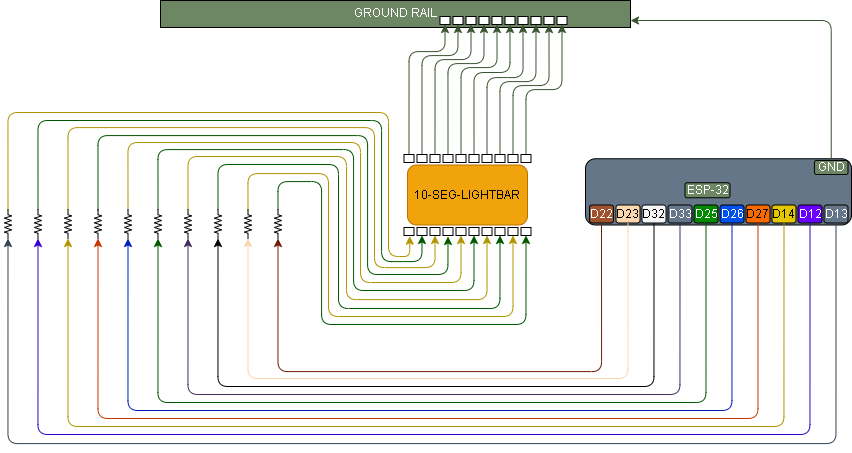

# 017 – LED Bar Graph Sweep

## What this does

Uses a 10-segment LED bar graph as ten separate LEDs and sweeps one lit segment across the display.

This module proves the LED bar graph wiring, polarity, resistor paths, and GPIO control before it is used in a larger sensor-driven project.

---

## What this teaches

* using a 10-segment LED bar graph
* treating each bar segment as an individual LED
* using one resistor per LED segment
* mapping several GPIO outputs
* testing wiring one output at a time
* spotting bad breadboard connections or ghost LEDs
* creating a simple visual sweep pattern

---

## Parts

* ESP32 dev board
* 10-segment LED bar graph
* 10 × 220Ω resistors
* breadboard
* jumper wires

---

## Wiring

Each LED segment is wired as its own output.

```text
ESP32 GPIO → resistor → LED bar segment
other side of LED segment → GND
```

Use one resistor per LED segment.

In this build, the LED bar was wired so the ESP32 GPIO pins drive the positive side of each segment.
The opposite side of each segment is connected to ground.

---

## GPIO Map

```text
LED 1  → GPIO13
LED 2  → GPIO12
LED 3  → GPIO14
LED 4  → GPIO27
LED 5  → GPIO26
LED 6  → GPIO25
LED 7  → GPIO33
LED 8  → GPIO32
LED 9  → GPIO23
LED 10 → GPIO22
```

---

## Wiring Diagram



---

## Important

Before running the full sweep code, prove one LED segment first.

A 10-segment LED bar graph can be confusing because it contains multiple LEDs inside one package.
If the polarity or breadboard rows are wrong, the display may not light, or a second segment may glow dimly.

In this build, a dim unwanted LED was caused by a loose / badly seated breadboard connection.
The fault was fixed by reseating the GPIO-side resistor/jumper connection.

---

## Bring-up wiring check

Use this first to prove one GPIO can blink one LED segment.

```python
from machine import Pin
from time import sleep

led = Pin(13, Pin.OUT)

while True:
    led.value(1)
    sleep(0.5)

    led.value(0)
    sleep(0.5)
```

Expected result:

```text
one LED segment blinks on and off
```

If nothing lights:

* check LED bar polarity
* check the resistor is in series with the LED
* check the GPIO wire is in the correct breadboard row
* check the ground side of the LED segment
* try another segment only after the first one is understood

If another LED glows dimly:

* check for a loose jumper
* check resistor seating
* check breadboard row alignment
* remove other connected segment wires and retest one LED only

---

## Code

```python
from machine import Pin
from time import sleep

led_pins = [
    13,
    12,
    14,
    27,
    26,
    25,
    33,
    32,
    23,
    22
]

leds = []

for pin_num in led_pins:
    pin = Pin(pin_num, Pin.OUT)
    pin.value(0)
    leds.append(pin)

print("017 LED Bar Graph Sweep")
print("Sweeping LEDs...")

while True:
    # Sweep one way
    for led in leds:
        led.value(1)
        sleep(0.15)
        led.value(0)

    sleep(0.3)

    # Sweep back the other way
    for led in reversed(leds):
        led.value(1)
        sleep(0.15)
        led.value(0)

    sleep(0.3)
```

---

## Code Explanation

```python
from machine import Pin
from time import sleep
```

Imports the MicroPython tools needed for the module.

```python
Pin
```

lets the ESP32 control GPIO pins as outputs.

```python
sleep
```

adds small delays so the LED movement can actually be seen.

---

```python
# LED bar GPIO order
led_pins = [
    13,
    12,
    14,
    27,
    26,
    25,
    33,
    32,
    23,
    22
]
```

This list defines which ESP32 GPIO pins are connected to each LED segment.

The order inside the list is important because it controls the sweep direction.

The first item:

```python
13
```

is treated as LED 1.

The last item:

```python
22
```

is treated as LED 10.

The physical build orientation may appear reversed in the wiring diagram depending on how the module was mounted during the real build.

---

```python
# Create output pins
leds = []
```

Creates an empty list called:

```python
leds
```

This list will later store all configured GPIO output objects.

---

```python
for pin_num in led_pins:
```

Loops through every GPIO number stored in the:

```python
led_pins
```

list.

The loop processes one GPIO pin at a time.

---

```python
pin = Pin(pin_num, Pin.OUT)
```

Configures the current GPIO pin as an output pin.

Example:

```python
Pin(13, Pin.OUT)
```

would configure GPIO13 as an output.

---

```python
pin.value(0)
```

Immediately turns the LED output off during startup.

This prevents random LEDs being left on during boot.

---

```python
leds.append(pin)
```

Stores the configured output pin inside the:

```python
leds
```

list.

By the end of the setup loop, the:

```python
leds
```

list contains all 10 configured output pins.

---

```python
print("017 LED Bar Graph Sweep")
print("Sweeping LEDs...")
```

Prints status messages to the serial console so the user knows the program has started correctly.

---

```python
while True:
```

Starts the main loop.

Everything inside this block repeats forever until the ESP32 is stopped or reset.

---

```python
# Sweep one way
for led in leds:
```

Loops through the LED list in normal order.

This creates the first sweep direction.

---

```python
led.value(1)
```

Turns the current LED segment on.

---

```python
sleep(0.15)
```

Waits for 0.15 seconds.

Without this delay, the sweep would move too fast to see properly.

---

```python
led.value(0)
```

Turns the current LED back off before moving to the next segment.

This creates the moving single-light effect.

---

```python
# Sweep back the other way
for led in reversed(leds):
```

Loops through the same LED list again, but in reverse order.

This creates the return sweep back across the display.

The result is a back-and-forth scanning pattern across the LED bar graph.

---

## Test

* wire the LED bar graph exactly as shown
* run the bring-up wiring check first
* confirm one LED segment blinks cleanly
* fix any loose or dim ghost LED issues before continuing
* run the full sweep code
* confirm one LED moves across the bar
* confirm the sweep reverses direction
* confirm no unwanted segments glow

---

## Definition of done

* one LED segment can be blinked from GPIO13
* all 10 LED segments are wired through their own resistors
* the full sweep runs across the LED bar
* the sweep runs back the other way
* no extra LEDs glow dimly
* wiring is stable when gently touched or moved

---

## What this enables next

* ultrasonic distance shown on an LED bar
* battery-style level indicators
* volume-style displays
* multi-output visual feedback
* sensor values mapped to display levels
