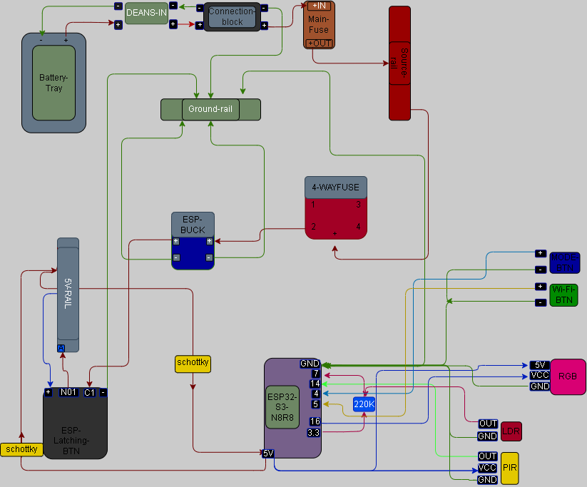

# ENZO V1 Wiring

Use the [V1 Wiring Reference](../../../../docs/WIRING_REFERENCES_T1_ENZO_v1_COMBINED.md) with the BOM and staged module guides.

Retained physical/as-built reference (for build and mounting context):

Supplementary electrical topology reference (for corrected connection, polarity and label truth): [WIRING_T1_ENZO_V1.svg](../../../../docs/WIRING_T1_ENZO_V1.svg).

The physical/as-built PNG remains useful build context. Where its older RGB data label, LDR component value or main-diode depiction conflicts with the corrected electrical reference and connection table, use the corrected electrical reference for connection/polarity truth. Historical physical mounting examples do not add requirements to Free V1.
